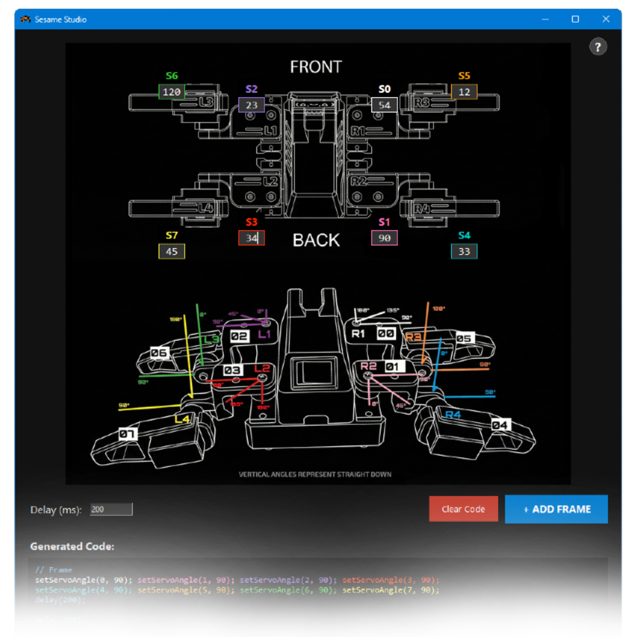

# Sesame Studio

Sesame Studio is a animation composer tool for the Sesame Robot. Use it to set servo angles and frames, generate C++ code, and sequence frames into animations.



## Features

- **Interface**: Black theme with schematic overlays.
- **Views**: Top-down view and lateral angle guide for positioning.
- **Color-Coding**: Servos (S0-S7) are color-coded in inputs and code for identification.
- **Help Overlay**: Guide window accessible via button.
- **Code Generation**: Formats `setServoAngle()` commands for `sesame-firmware.ino`.
- **Timing**: Set delays for frames to create movements.

## Prerequisites

- **Python 3.x**: Download from [python.org](https://python.org).
- **Pillow**: Used for scaling schematics.
  ```bash
  pip install Pillow
  ```
- **Tkinter**: If missing, install `python3-tk`.

## How to Use

1.  **Launch**:
    ```bash
    python sesame_studio.py
    ```

2.  **Set Pose**:
    - The section displays the robot schematic with boxes over joints.
    - Enter angles (0-180) into boxes.
    - Use the **Help (?)** button for the guide.

3.  **Set Timing**:
    - Adjust the `Delay (ms)` field.
    - Click **+ ADD FRAME**. Code appears in the editor.

4.  **Export**:
    - Click **Copy to Clipboard** and paste into Arduino IDE.
    - Use **Clear Code** to start a sequence.

## Troubleshooting

- **"Module not found: tkinter"**: On some Linux distributions, you may need to install it separately (`sudo apt-get install python3-tk`).
- **High DPI Scaling**: If the interface looks tiny or huge on your screen, try changing the "High DPI scaling override" in the `python.exe` compatibility settings properties on Windows.
